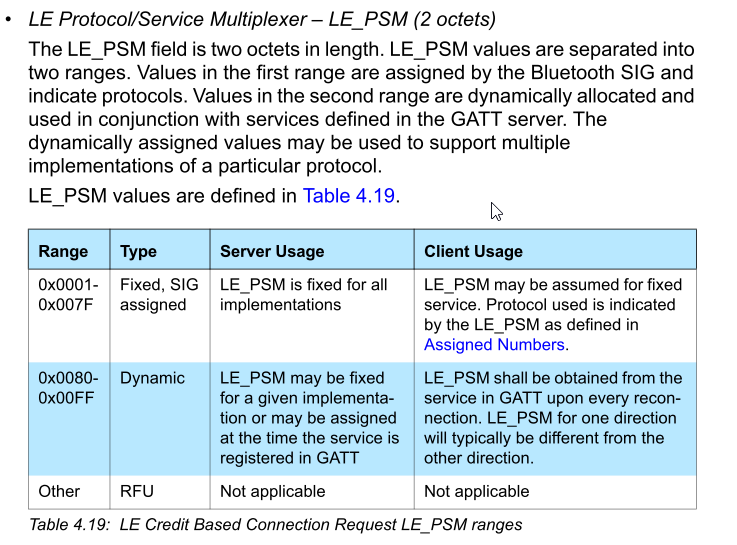

# @capacitor-trancee/nearby

Uses Bluetooth LE to scan and advertise for nearby devices

## Install

```bash
npm install @capacitor-trancee/nearby
npx cap sync
```

## Example

```typescript
```

## Bluetooth

BLUETOOTH CORE SPECIFICATION Version 5.1 | Vol 3, Part A

4.22 LE CREDIT BASED CONNECTION REQUEST (CODE 0x14)



## Configuration

### Android

```java
    <uses-permission
        android:name="android.permission.BLUETOOTH"
        android:maxSdkVersion="30" />
    <!-- https://developer.android.com/develop/connectivity/bluetooth/bt-permissions#discover-local-devices -->
    <uses-permission
        android:name="android.permission.BLUETOOTH_ADMIN"
        android:maxSdkVersion="30" />

    <uses-permission
        android:name="android.permission.BLUETOOTH_ADVERTISE"
        android:minSdkVersion="31" />
    <uses-permission
        android:name="android.permission.BLUETOOTH_CONNECT"
        android:minSdkVersion="31" />
    <uses-permission
        android:name="android.permission.BLUETOOTH_SCAN"
        android:minSdkVersion="31"
        android:usesPermissionFlags="neverForLocation"
        tools:targetApi="s" />

    <uses-permission
        android:name="android.permission.ACCESS_COARSE_LOCATION"
        android:maxSdkVersion="28" />
    <uses-permission
        android:name="android.permission.ACCESS_FINE_LOCATION"
        android:maxSdkVersion="31"
        android:minSdkVersion="29"
        tools:ignore="CoarseFineLocation" />

    <!-- https://developer.android.com/develop/connectivity/bluetooth/bt-permissions#features -->
    <uses-feature
        android:name="android.hardware.bluetooth"
        android:required="false" />
    <uses-feature
        android:name="android.hardware.bluetooth_le"
        android:required="true" />
```

<docgen-config>
<!--Update the source file JSDoc comments and rerun docgen to update the docs below-->

These configuration values are available:

| Prop               | Type                                            | Description                                                                                                                                                                                             | Since |
| ------------------ | ----------------------------------------------- | ------------------------------------------------------------------------------------------------------------------------------------------------------------------------------------------------------- | ----- |
| **`endpointName`** | <code>string</code>                             | A human readable name for this endpoint, to appear on the remote device.                                                                                                                                | 4.1.0 |
| **`endpointInfo`** | <code>string</code>                             | Identifing information about this endpoint, to appear on the remote device. ___Note: maximum length is 14 bytes.___                                                                                     | 4.1.0 |
| **`serviceID`**    | <code><a href="#serviceid">ServiceID</a></code> | An identifier to advertise your app to other endpoints. The `serviceID` value must uniquely identify your app. As a best practice, use the package name of your app (for example, `com.example.myapp`). | 4.1.0 |

### Examples

In `capacitor.config.json`:

```json
{
  "plugins": {
    "Nearby": {
      "endpointName": "My App",
      "endpointInfo": "TXkgQXBw",
      "serviceID": "com.example.myapp"
    }
  }
}
```

In `capacitor.config.ts`:

```ts
/// <reference types="@capacitor-trancee/nearby" />

import { CapacitorConfig } from '@capacitor/cli';

const config: CapacitorConfig = {
  plugins: {
    Nearby: {
      endpointName: "My App",
      endpointInfo: "TXkgQXBw",
      serviceID: "com.example.myapp",
    },
  },
};

export default config;
```

</docgen-config>

## API

<docgen-index>

* [`initialize(...)`](#initialize)
* [`reset()`](#reset)
* [`startAdvertising(...)`](#startadvertising)
* [`stopAdvertising()`](#stopadvertising)
* [`startDiscovering()`](#startdiscovering)
* [`stopDiscovering()`](#stopdiscovering)
* [`requestConnection(...)`](#requestconnection)
* [`acceptConnection(...)`](#acceptconnection)
* [`rejectConnection(...)`](#rejectconnection)
* [`connect(...)`](#connect)
* [`disconnect(...)`](#disconnect)
* [`sendPayload(...)`](#sendpayload)
* [`status()`](#status)
* [`checkPermissions()`](#checkpermissions)
* [`requestPermissions(...)`](#requestpermissions)
* [`addListener('onPermissionChanged', ...)`](#addlisteneronpermissionchanged-)
* [`addListener('onBluetoothStateChanged', ...)`](#addlisteneronbluetoothstatechanged-)
* [`addListener('onEndpointFound', ...)`](#addlisteneronendpointfound-)
* [`addListener('onEndpointLost', ...)`](#addlisteneronendpointlost-)
* [`addListener('onEndpointInitiated', ...)`](#addlisteneronendpointinitiated-)
* [`addListener('onEndpointConnected', ...)`](#addlisteneronendpointconnected-)
* [`addListener('onEndpointRejected', ...)`](#addlisteneronendpointrejected-)
* [`addListener('onEndpointFailed', ...)`](#addlisteneronendpointfailed-)
* [`addListener('onEndpointDisconnected', ...)`](#addlisteneronendpointdisconnected-)
* [`addListener('onPayloadReceived', ...)`](#addlisteneronpayloadreceived-)
* [Interfaces](#interfaces)
* [Type Aliases](#type-aliases)
* [Enums](#enums)

</docgen-index>

<docgen-api>
<!--Update the source file JSDoc comments and rerun docgen to update the docs below-->

### initialize(...)

```typescript
initialize(options?: InitializeOptions | undefined) => Promise<InitializeResult>
```

Initializes Nearby for advertising and discovering of endpoints.

| Param         | Type                                                            |
| ------------- | --------------------------------------------------------------- |
| **`options`** | <code><a href="#initializeoptions">InitializeOptions</a></code> |

**Returns:** <code>Promise&lt;<a href="#initializeresult">InitializeResult</a>&gt;</code>

**Since:** 4.1.0

--------------------


### reset()

```typescript
reset() => Promise<void>
```

Stops and resets advertising and discovering of endpoints.

**Since:** 4.1.0

--------------------


### startAdvertising(...)

```typescript
startAdvertising(options?: StartAdvertisingOptions | undefined) => Promise<void>
```

Starts advertising the local endpoint.

| Param         | Type                                                                        |
| ------------- | --------------------------------------------------------------------------- |
| **`options`** | <code><a href="#startadvertisingoptions">StartAdvertisingOptions</a></code> |

**Since:** 4.1.0

--------------------


### stopAdvertising()

```typescript
stopAdvertising() => Promise<void>
```

Stops advertising the local endpoint.

**Since:** 4.1.0

--------------------


### startDiscovering()

```typescript
startDiscovering() => Promise<void>
```

Starts discovering remote endpoints.

**Since:** 4.1.0

--------------------


### stopDiscovering()

```typescript
stopDiscovering() => Promise<void>
```

Stops discovering remote endpoints.

**Since:** 4.1.0

--------------------


### requestConnection(...)

```typescript
requestConnection(options: RequestConnectionOptions) => Promise<void>
```

Sends a request to connect to a remote endpoint.

| Param         | Type                                                                          |
| ------------- | ----------------------------------------------------------------------------- |
| **`options`** | <code><a href="#requestconnectionoptions">RequestConnectionOptions</a></code> |

**Since:** 4.1.0

--------------------


### acceptConnection(...)

```typescript
acceptConnection(options: AcceptConnectionOptions) => Promise<void>
```

Accepts a connection to a remote endpoint.

| Param         | Type                                                                        |
| ------------- | --------------------------------------------------------------------------- |
| **`options`** | <code><a href="#acceptconnectionoptions">AcceptConnectionOptions</a></code> |

**Since:** 4.1.0

--------------------


### rejectConnection(...)

```typescript
rejectConnection(options: RejectConnectionOptions) => Promise<void>
```

Rejects a connection to a remote endpoint.

| Param         | Type                                                                        |
| ------------- | --------------------------------------------------------------------------- |
| **`options`** | <code><a href="#rejectconnectionoptions">RejectConnectionOptions</a></code> |

**Since:** 4.1.0

--------------------


### connect(...)

```typescript
connect(options: ConnectOptions) => Promise<void>
```

Connects to a remote endpoint.

| Param         | Type                                                      |
| ------------- | --------------------------------------------------------- |
| **`options`** | <code><a href="#connectoptions">ConnectOptions</a></code> |

**Since:** 4.1.0

--------------------


### disconnect(...)

```typescript
disconnect(options: DisconnectOptions) => Promise<void>
```

Disconnects from a remote endpoint.
`Payload`s can no longer be sent to or received from the endpoint after this method is called.

| Param         | Type                                                            |
| ------------- | --------------------------------------------------------------- |
| **`options`** | <code><a href="#disconnectoptions">DisconnectOptions</a></code> |

**Since:** 4.1.0

--------------------


### sendPayload(...)

```typescript
sendPayload(options: SendPayloadOptions) => Promise<void>
```

Sends a <a href="#payload">`Payload`</a> to a remote endpoint.

| Param         | Type                                                              |
| ------------- | ----------------------------------------------------------------- |
| **`options`** | <code><a href="#sendpayloadoptions">SendPayloadOptions</a></code> |

**Since:** 4.1.0

--------------------


### status()

```typescript
status() => Promise<StatusResult>
```

Returns advertising and discovering status, and discovered endpoints.

**Returns:** <code>Promise&lt;<a href="#statusresult">StatusResult</a>&gt;</code>

**Since:** 4.1.0

--------------------


### checkPermissions()

```typescript
checkPermissions() => Promise<PermissionStatus>
```

Check for the appropriate permissions to use Nearby.

**Returns:** <code>Promise&lt;<a href="#permissionstatus">PermissionStatus</a>&gt;</code>

**Since:** 4.1.0

--------------------


### requestPermissions(...)

```typescript
requestPermissions(permissions?: NearbyPermissions | undefined) => Promise<PermissionStatus>
```

Request the appropriate permissions to use Nearby.

| Param             | Type                                                            |
| ----------------- | --------------------------------------------------------------- |
| **`permissions`** | <code><a href="#nearbypermissions">NearbyPermissions</a></code> |

**Returns:** <code>Promise&lt;<a href="#permissionstatus">PermissionStatus</a>&gt;</code>

**Since:** 4.1.0

--------------------


### addListener('onPermissionChanged', ...)

```typescript
addListener(eventName: 'onPermissionChanged', listenerFunc: (granted: boolean) => void) => Promise<PluginListenerHandle>
```

Called when permission is granted or revoked for this app to use Nearby.

| Param              | Type                                       |
| ------------------ | ------------------------------------------ |
| **`eventName`**    | <code>'onPermissionChanged'</code>         |
| **`listenerFunc`** | <code>(granted: boolean) =&gt; void</code> |

**Returns:** <code>Promise&lt;<a href="#pluginlistenerhandle">PluginListenerHandle</a>&gt;</code>

**Since:** 4.1.0

--------------------


### addListener('onBluetoothStateChanged', ...)

```typescript
addListener(eventName: 'onBluetoothStateChanged', listenerFunc: (state: BluetoothState) => void) => Promise<PluginListenerHandle>
```

Called when state of Bluetooth has changed.

| Param              | Type                                                                          |
| ------------------ | ----------------------------------------------------------------------------- |
| **`eventName`**    | <code>'onBluetoothStateChanged'</code>                                        |
| **`listenerFunc`** | <code>(state: <a href="#bluetoothstate">BluetoothState</a>) =&gt; void</code> |

**Returns:** <code>Promise&lt;<a href="#pluginlistenerhandle">PluginListenerHandle</a>&gt;</code>

**Since:** 4.1.0

--------------------


### addListener('onEndpointFound', ...)

```typescript
addListener(eventName: 'onEndpointFound', listenerFunc: EndpointFoundCallback) => Promise<PluginListenerHandle>
```

Called when a remote endpoint is discovered.

| Param              | Type                                                                    |
| ------------------ | ----------------------------------------------------------------------- |
| **`eventName`**    | <code>'onEndpointFound'</code>                                          |
| **`listenerFunc`** | <code><a href="#endpointfoundcallback">EndpointFoundCallback</a></code> |

**Returns:** <code>Promise&lt;<a href="#pluginlistenerhandle">PluginListenerHandle</a>&gt;</code>

**Since:** 4.1.0

--------------------


### addListener('onEndpointLost', ...)

```typescript
addListener(eventName: 'onEndpointLost', listenerFunc: EndpointLostCallback) => Promise<PluginListenerHandle>
```

Called when a remote endpoint is no longer discoverable.

| Param              | Type                                                                  |
| ------------------ | --------------------------------------------------------------------- |
| **`eventName`**    | <code>'onEndpointLost'</code>                                         |
| **`listenerFunc`** | <code><a href="#endpointlostcallback">EndpointLostCallback</a></code> |

**Returns:** <code>Promise&lt;<a href="#pluginlistenerhandle">PluginListenerHandle</a>&gt;</code>

**Since:** 4.1.0

--------------------


### addListener('onEndpointInitiated', ...)

```typescript
addListener(eventName: 'onEndpointInitiated', listenerFunc: EndpointInitiatedCallback) => Promise<PluginListenerHandle>
```

A basic encrypted channel has been created between you and the endpoint.
Both sides are now asked if they wish to accept or reject the connection before any data can be sent over this channel.

| Param              | Type                                                                            |
| ------------------ | ------------------------------------------------------------------------------- |
| **`eventName`**    | <code>'onEndpointInitiated'</code>                                              |
| **`listenerFunc`** | <code><a href="#endpointinitiatedcallback">EndpointInitiatedCallback</a></code> |

**Returns:** <code>Promise&lt;<a href="#pluginlistenerhandle">PluginListenerHandle</a>&gt;</code>

**Since:** 4.1.0

--------------------


### addListener('onEndpointConnected', ...)

```typescript
addListener(eventName: 'onEndpointConnected', listenerFunc: EndpointConnectedCallback) => Promise<PluginListenerHandle>
```

Called after both sides have accepted the connection.
Both sides may now send Payloads to each other.

| Param              | Type                                                                            |
| ------------------ | ------------------------------------------------------------------------------- |
| **`eventName`**    | <code>'onEndpointConnected'</code>                                              |
| **`listenerFunc`** | <code><a href="#endpointconnectedcallback">EndpointConnectedCallback</a></code> |

**Returns:** <code>Promise&lt;<a href="#pluginlistenerhandle">PluginListenerHandle</a>&gt;</code>

**Since:** 4.1.0

--------------------


### addListener('onEndpointRejected', ...)

```typescript
addListener(eventName: 'onEndpointRejected', listenerFunc: EndpointRejectedCallback) => Promise<PluginListenerHandle>
```

Called when either side rejected the connection.
Payloads can not be exchaged.

| Param              | Type                                                                          |
| ------------------ | ----------------------------------------------------------------------------- |
| **`eventName`**    | <code>'onEndpointRejected'</code>                                             |
| **`listenerFunc`** | <code><a href="#endpointrejectedcallback">EndpointRejectedCallback</a></code> |

**Returns:** <code>Promise&lt;<a href="#pluginlistenerhandle">PluginListenerHandle</a>&gt;</code>

**Since:** 4.1.0

--------------------


### addListener('onEndpointFailed', ...)

```typescript
addListener(eventName: 'onEndpointFailed', listenerFunc: EndpointFailedCallback) => Promise<PluginListenerHandle>
```

| Param              | Type                                                                      |
| ------------------ | ------------------------------------------------------------------------- |
| **`eventName`**    | <code>'onEndpointFailed'</code>                                           |
| **`listenerFunc`** | <code><a href="#endpointfailedcallback">EndpointFailedCallback</a></code> |

**Returns:** <code>Promise&lt;<a href="#pluginlistenerhandle">PluginListenerHandle</a>&gt;</code>

--------------------


### addListener('onEndpointDisconnected', ...)

```typescript
addListener(eventName: 'onEndpointDisconnected', listenerFunc: EndpointDisconnectedCallback) => Promise<PluginListenerHandle>
```

Called when a remote endpoint is disconnected or has become unreachable.

| Param              | Type                                                                                  |
| ------------------ | ------------------------------------------------------------------------------------- |
| **`eventName`**    | <code>'onEndpointDisconnected'</code>                                                 |
| **`listenerFunc`** | <code><a href="#endpointdisconnectedcallback">EndpointDisconnectedCallback</a></code> |

**Returns:** <code>Promise&lt;<a href="#pluginlistenerhandle">PluginListenerHandle</a>&gt;</code>

**Since:** 4.1.0

--------------------


### addListener('onPayloadReceived', ...)

```typescript
addListener(eventName: 'onPayloadReceived', listenerFunc: PayloadReceivedCallback) => Promise<PluginListenerHandle>
```

Called when a <a href="#payload">`Payload`</a> is received from a remote endpoint.

| Param              | Type                                                                        |
| ------------------ | --------------------------------------------------------------------------- |
| **`eventName`**    | <code>'onPayloadReceived'</code>                                            |
| **`listenerFunc`** | <code><a href="#payloadreceivedcallback">PayloadReceivedCallback</a></code> |

**Returns:** <code>Promise&lt;<a href="#pluginlistenerhandle">PluginListenerHandle</a>&gt;</code>

**Since:** 4.1.0

--------------------


### Interfaces


#### InitializeResult

| Prop             | Type                                              | Description                            | Since |
| ---------------- | ------------------------------------------------- | -------------------------------------- | ----- |
| **`endpointID`** | <code><a href="#endpointid">EndpointID</a></code> | A unique identifier for this endpoint. | 4.1.0 |


#### InitializeOptions

| Prop               | Type                                            | Description                                                                                                                                                                                             | Since |
| ------------------ | ----------------------------------------------- | ------------------------------------------------------------------------------------------------------------------------------------------------------------------------------------------------------- | ----- |
| **`endpointName`** | <code>string</code>                             | A human readable name for this endpoint, to appear on the remote device.                                                                                                                                | 4.1.0 |
| **`endpointInfo`** | <code>string</code>                             | Identifing information about this endpoint, to appear on the remote device. ___Note: maximum length is 14 bytes.___                                                                                     | 4.1.0 |
| **`serviceID`**    | <code><a href="#serviceid">ServiceID</a></code> | An identifier to advertise your app to other endpoints. The `serviceID` value must uniquely identify your app. As a best practice, use the package name of your app (for example, `com.example.myapp`). | 4.1.0 |


#### StartAdvertisingOptions

| Prop               | Type                | Description                                                                         | Since |
| ------------------ | ------------------- | ----------------------------------------------------------------------------------- | ----- |
| **`endpointInfo`** | <code>string</code> | Identifing information about this endpoint. ___Note: maximum length is 14 bytes.___ | 4.1.0 |


#### RequestConnectionOptions

| Prop               | Type                                              | Description                                                                         | Since |
| ------------------ | ------------------------------------------------- | ----------------------------------------------------------------------------------- | ----- |
| **`endpointID`**   | <code><a href="#endpointid">EndpointID</a></code> | The identifier for the remote endpoint to which a connection request will be sent.  | 4.1.0 |
| **`endpointInfo`** | <code>string</code>                               | Identifing information about this endpoint. ___Note: maximum length is 14 bytes.___ | 4.1.0 |


#### AcceptConnectionOptions

| Prop             | Type                                              | Description                             | Since |
| ---------------- | ------------------------------------------------- | --------------------------------------- | ----- |
| **`endpointID`** | <code><a href="#endpointid">EndpointID</a></code> | The identifier for the remote endpoint. | 4.1.0 |


#### RejectConnectionOptions

| Prop             | Type                                              | Description                             | Since |
| ---------------- | ------------------------------------------------- | --------------------------------------- | ----- |
| **`endpointID`** | <code><a href="#endpointid">EndpointID</a></code> | The identifier for the remote endpoint. | 4.1.0 |


#### ConnectOptions

| Prop             | Type                                              | Description                                           | Since |
| ---------------- | ------------------------------------------------- | ----------------------------------------------------- | ----- |
| **`endpointID`** | <code><a href="#endpointid">EndpointID</a></code> | The identifier for the remote endpoint to connect to. | 4.1.0 |


#### DisconnectOptions

| Prop             | Type                                              | Description                                                | Since |
| ---------------- | ------------------------------------------------- | ---------------------------------------------------------- | ----- |
| **`endpointID`** | <code><a href="#endpointid">EndpointID</a></code> | The identifier for the remote endpoint to disconnect from. | 4.1.0 |


#### SendPayloadOptions

| Prop              | Type                                              | Description                                                                   | Since |
| ----------------- | ------------------------------------------------- | ----------------------------------------------------------------------------- | ----- |
| **`endpointID`**  | <code><a href="#endpointid">EndpointID</a></code> | The identifier for the remote endpoint to which the payload should be sent.   | 4.1.0 |
| **`endpointIDs`** | <code>string[]</code>                             | The identifiers for the remote endpoints to which the payload should be sent. | 4.1.0 |
| **`payload`**     | <code>string</code>                               | The <a href="#payload">`Payload`</a> to be sent.                              | 4.1.0 |


#### StatusResult

| Prop                | Type                 |
| ------------------- | -------------------- |
| **`isAdvertising`** | <code>boolean</code> |
| **`isDiscovering`** | <code>boolean</code> |


#### PermissionStatus

| Prop            | Type                                                        | Description                                                                                                                                                                                                                                                                                                                                                                                                   | Since |
| --------------- | ----------------------------------------------------------- | ------------------------------------------------------------------------------------------------------------------------------------------------------------------------------------------------------------------------------------------------------------------------------------------------------------------------------------------------------------------------------------------------------------- | ----- |
| **`bluetooth`** | <code><a href="#permissionstate">PermissionState</a></code> | `BLUETOOTH_ADVERTISE` Required to be able to advertise to nearby Bluetooth devices. `BLUETOOTH_CONNECT` Required to be able to connect to paired Bluetooth devices. `BLUETOOTH_SCAN` Required to be able to discover and pair nearby Bluetooth devices. `BLUETOOTH` Allows applications to connect to paired bluetooth devices. `BLUETOOTH_ADMIN` Allows applications to discover and pair bluetooth devices. | 4.1.0 |
| **`location`**  | <code><a href="#permissionstate">PermissionState</a></code> | `ACCESS_FINE_LOCATION` Allows an app to access precise location. `ACCESS_COARSE_LOCATION` Allows an app to access approximate location.                                                                                                                                                                                                                                                                       | 4.1.0 |


#### NearbyPermissions

| Prop              | Type                                |
| ----------------- | ----------------------------------- |
| **`permissions`** | <code>NearbyPermissionType[]</code> |


#### PluginListenerHandle

| Prop         | Type                                      |
| ------------ | ----------------------------------------- |
| **`remove`** | <code>() =&gt; Promise&lt;void&gt;</code> |


#### Endpoint

| Prop               | Type                                              | Description                                                                         | Since |
| ------------------ | ------------------------------------------------- | ----------------------------------------------------------------------------------- | ----- |
| **`endpointID`**   | <code><a href="#endpointid">EndpointID</a></code> | The ID of the remote endpoint that was discovered.                                  | 4.1.0 |
| **`endpointName`** | <code>string</code>                               | A human readable name for this endpoint.                                            | 4.1.0 |
| **`endpointInfo`** | <code>string</code>                               | Identifing information about this endpoint. ___Note: maximum length is 14 bytes.___ | 4.1.0 |


#### Payload

A <a href="#payload">Payload</a> sent between devices.

| Prop          | Type                | Description                          | Since |
| ------------- | ------------------- | ------------------------------------ | ----- |
| **`payload`** | <code>string</code> | <a href="#payload">Payload</a> data. | 4.1.0 |


### Type Aliases


#### EndpointID

Used to represent an endpoint.

<code>string</code>


#### ServiceID

Used to represent a service identifier.

<code>string</code>


#### PermissionState

<code>'prompt' | 'prompt-with-rationale' | 'granted' | 'denied'</code>


#### NearbyPermissionType

<code>'bluetooth' | 'location'</code>


#### EndpointFoundCallback

Called when a remote endpoint is discovered.

<code>(_: <a href="#endpoint">Endpoint</a>): void</code>


#### EndpointLostCallback

Called when a remote endpoint is no longer discoverable.

<code>(_: <a href="#endpoint">Endpoint</a>): void</code>


#### EndpointInitiatedCallback

A basic encrypted channel has been created between you and the endpoint.
Both sides are now asked if they wish to accept or reject the connection before any data can be sent over this channel.

<code>(_: <a href="#endpoint">Endpoint</a>): void</code>


#### EndpointConnectedCallback

Called after both sides have accepted the connection.
Both sides may now send Payloads to each other.

<code>(_: <a href="#endpoint">Endpoint</a>): void</code>


#### EndpointRejectedCallback

Called when either side rejected the connection.
Payloads can not be exchaged.

<code>(_: <a href="#endpoint">Endpoint</a>): void</code>


#### EndpointFailedCallback

<code>(_: <a href="#endpoint">Endpoint</a>): void</code>


#### EndpointDisconnectedCallback

Called when a remote endpoint is disconnected or has become unreachable.
At this point service (re-)discovery may start again.

<code>(_: <a href="#endpoint">Endpoint</a>): void</code>


#### PayloadReceivedCallback

Called when a payload is received from a remote endpoint. Depending on the type of the payload,
all of the data may or may not have been received at the time of this call.

<code>(_: <a href="#endpoint">Endpoint</a> & <a href="#payload">Payload</a>): void</code>


### Enums


#### BluetoothState

| Members            | Value                       | Description                                                                                         | Since |
| ------------------ | --------------------------- | --------------------------------------------------------------------------------------------------- | ----- |
| **`UNKNOWN`**      | <code>'unknown'</code>      | The manager’s state is unknown.                                                                     | 1.0.0 |
| **`RESETTING`**    | <code>'resetting'</code>    | A state that indicates the connection with the system service was momentarily lost.                 | 1.0.0 |
| **`UNSUPPORTED`**  | <code>'unsupported'</code>  | A state that indicates this device doesn’t support the Bluetooth low energy central or client role. | 1.0.0 |
| **`UNAUTHORIZED`** | <code>'unauthorized'</code> | A state that indicates the application isn’t authorized to use the Bluetooth low energy role.       | 1.0.0 |
| **`POWERED_OFF`**  | <code>'poweredOff'</code>   | A state that indicates Bluetooth is currently powered off.                                          | 1.0.0 |
| **`POWERED_ON`**   | <code>'poweredOn'</code>    | A state that indicates Bluetooth is currently powered on and available to use.                      | 1.0.0 |

</docgen-api>
